# LifePilot AI — Final ERD

The ERD below focuses on primary cross-domain relationships. Domain migrations remain the source of truth for every column and secondary lookup table.

```mermaid
erDiagram
    USERS ||--o{ HOUSEHOLD_MEMBERS : joins
    HOUSEHOLDS ||--o{ HOUSEHOLD_MEMBERS : contains
    HOUSEHOLDS ||--o{ HOUSEHOLD_INVITATIONS : issues
    HOUSEHOLDS ||--o{ SHARED_RESOURCES : scopes
    USERS ||--o{ SHARED_RESOURCES : owns

    USERS ||--o{ DOCUMENTS : owns
    HOUSEHOLDS ||--o{ DOCUMENTS : contains
    DOCUMENTS ||--o{ DOCUMENT_VERSIONS : versions
    DOCUMENTS ||--o{ DOCUMENT_EXTRACTIONS : extracts
    DOCUMENT_EXTRACTIONS ||--o{ EXTRACTED_FIELDS : fields

    USERS ||--o{ TASKS : owns
    HOUSEHOLDS ||--o{ TASKS : contains
    DOCUMENTS ||--o{ TASKS : grounds
    OBLIGATIONS ||--o{ TASKS : produces
    TASKS ||--o{ REMINDERS : has
    TASKS ||--o{ ASSIGNMENTS : assigned

    USERS ||--o{ EXPENSES : owns
    HOUSEHOLDS ||--o{ EXPENSES : contains
    SUBSCRIPTIONS ||--o{ SUBSCRIPTION_PAYMENTS : records
    SUBSCRIPTIONS ||--o{ EXPENSES : links
    ASSETS ||--o{ WARRANTIES : covered_by
    ASSETS ||--o{ MAINTENANCE_RECORDS : maintained_by

    USERS ||--o{ CALENDAR_EVENTS : owns
    HOUSEHOLDS ||--o{ CALENDAR_EVENTS : contains
    TASKS ||--o{ CALENDAR_EVENTS : links
    USERS ||--o{ LIFE_NOTIFICATIONS : receives
    LIFE_NOTIFICATIONS ||--o{ NOTIFICATION_DELIVERIES : attempts

    USERS ||--o{ CONVERSATION_SESSIONS : owns
    CONVERSATION_SESSIONS ||--o{ CONVERSATION_MESSAGES : contains
    CONVERSATION_SESSIONS ||--o{ RETRIEVAL_TRACES : traces
    CONVERSATION_MESSAGES ||--o{ ACTION_PLANS : recommends

    ACTION_PLANS ||--o{ ACTION_STEPS : contains
    ACTION_PLANS ||--o{ ACTION_APPROVALS : requires
    ACTION_STEPS ||--o{ ACTION_EXECUTIONS : executes
    ACTION_EXECUTIONS ||--o| ACTION_RESULTS : verifies

    USERS ||--o{ PREDICTION_RECORDS : receives
    USERS ||--o{ ANALYTICS_INSIGHTS : receives
    USERS ||--o{ DATA_QUALITY_CHECKS : receives

    USERS ||--o{ EVALUATION_RUNS : executes
    EVALUATION_RUNS ||--o{ EVALUATION_METRIC_RESULTS : contains
    HOUSEHOLDS ||--o{ EVALUATION_CASES : benchmarks
    USERS ||--o{ SECURITY_REVIEW_RESULTS : reviews
```

## P12 evaluation entities

### `evaluation_runs`
A version-independent snapshot of one final evaluation run.

### `evaluation_cases`
Optional labeled benchmark cases. LifePilot does not infer missing ground truth. Cases can represent `pass`, `fail`, `tp`, `fp`, `fn`, or `tn` outcomes.

### `evaluation_metric_results`
Persisted metric result for a system variant and metric key. A nullable `value` plus `status=not_measured` is deliberate when evidence is insufficient.

### `security_review_results`
Persisted security-review checklist. Automated/implemented checks are distinguished from production items that still require manual review.
