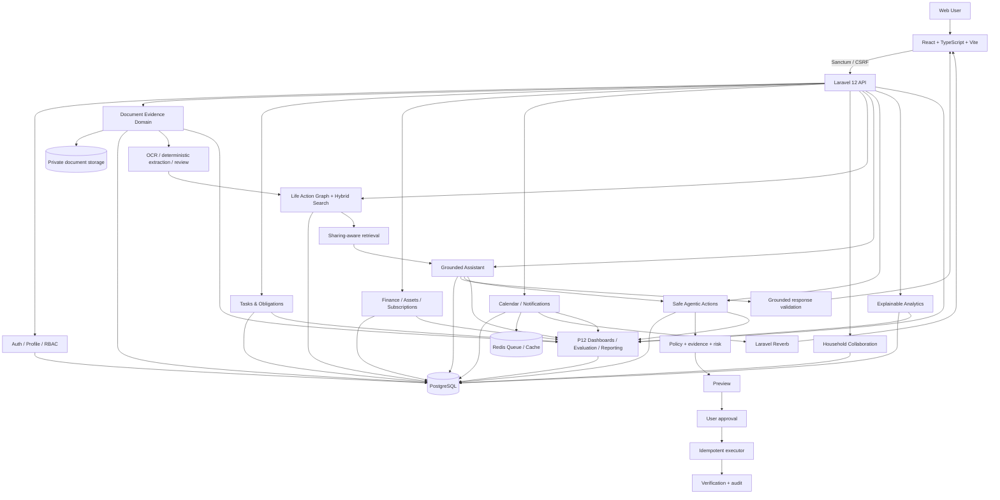

# LifePilot AI — Final Architecture

## System architecture

## Trust boundaries

1. Browser input is untrusted and validated by Laravel requests/controllers.
2. Uploaded documents are **evidence, not instructions**.
3. Retrieved text is untrusted before it enters the grounded-assistant prompt.
4. Same-household membership does not imply access to another member's private resources.
5. AI recommendations do not execute high-impact actions directly.
6. P9 action execution requires preview, policy/evidence validation, risk classification and approval.
7. P12 evaluation refuses to create benchmark scores when labeled ground truth is absent.

## Core technology

- Frontend: React, TypeScript, Vite, React Router.
- API: Laravel 12 / PHP 8.3.
- Authentication: Laravel Sanctum.
- Database: PostgreSQL.
- Queue/cache: Redis.
- Realtime: Laravel Reverb.
- Search: deterministic embeddings / hybrid retrieval with pgvector optional and PHP cosine fallback.
- AI: provider adapter behind a grounded validation layer; deterministic fallback remains available.
